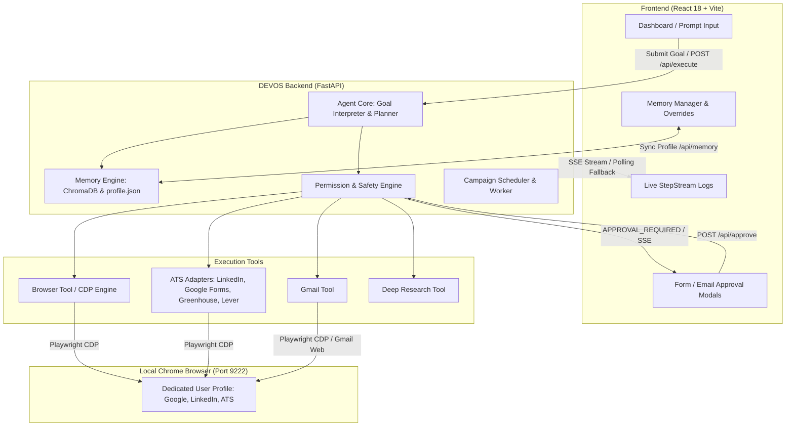

# 🤖 DEVOS: Autonomous AI Agent & Operating System for Career Workflows

<p align="center">
  
  
  
  
  
  
  
</p>

DEVOS is an autonomous, local-first AI agent and personal operating system tailored for career acceleration, intelligent job application automation, recruiter outreach, and deep web research.

Unlike cloud scraping bots that get blocked by CAPTCHAs and bot detectors, DEVOS connects directly to your **real local Chrome browser** via the Chrome DevTools Protocol (CDP). It leverages your existing sessions, cookies, and logins while keeping **you** in full control through human-in-the-loop safety gates.

---

## 🌟 Key Highlights

- 🎯 **Autonomous Goal Interpreter & Planner:** Translates natural language objectives (e.g., *"Apply to the Google Form at [URL] using my resume and location Bhiwani"*) into verifiable, executable action plans.
- 🌐 **Real-Session CDP Browser Automation:** Connects to an existing Chrome instance on port `9222`. No headless detection flags, full session reuse (Google, LinkedIn, etc.), and native typing emulation.
- ⚡ **Specialized ATS & Form Adapters:**
  - **Google Forms:** Auto-detects text inputs, date pickers (`YYYY-MM-DD`), dropdowns, and radio options (including smart multi-pass normalized matching for range questions like `8-9` for a CGPA of `8.7`).
  - **LinkedIn Easy Apply:** Auto-navigates job postings, opens SDUI flows, handles multi-page application dialogs, and populates form data.
  - **Greenhouse & Lever:** Tailored DOM parsing and auto-fill engines for leading applicant tracking systems.
- 🧠 **Candidate Memory & Semantic Vector Engine:**
  - Persistent profile storage (`models/profile.json`) with fine-grained overrides (location, address, custom answers).
  - Built-in PDF/DOCX resume ingestion with ChromaDB vector memory for context-aware Q&A synthesis.
  - Generates custom, personalized answers for subjective questions (*"Why are you a good fit for this role?"*).
- ✉️ **Recruiter Outreach & Campaign Scheduler:**
  - Automated recruiter pipeline discovery and personalized cold email drafting.
  - Direct Gmail automation via Chrome.
  - Background campaign scheduler with configurable batching, rate limiting, and progress tracking.
- 🛡️ **Human-in-the-Loop Approval Gates:**
  - Preview every form fill and email draft before anything is submitted or sent.
  - One-click approve or reject via real-time interactive UI modals.
- 💻 **Real-Time Responsive React UI:**
  - Live agent thought and action telemetry streamed via Server-Sent Events (SSE) with resilient HTTP polling fallback.
  - Mobile-responsive layout, dark-mode terminal logs, and dedicated candidate memory manager.

---

## 🏗️ System Architecture



---

## 📂 Project Structure

```text
DEVOS/
├── backend/
│   ├── app/
│   │   ├── agent/                 # Autonomous agent planner, executor & tool registry
│   │   │   ├── agent_state.py     # State models & goal types
│   │   │   ├── executor.py        # Asynchronous plan execution engine
│   │   │   ├── goal_interpreter.py# Natural language goal decomposition
│   │   │   ├── llm_agent.py       # LLM integration & prompt orchestration
│   │   │   ├── planner.py         # Multi-step plan generator
│   │   │   ├── recovery.py        # Execution retry & error recovery
│   │   │   └── tool_registry.py   # Tool lookup and invocation dispatch
│   │   ├── core/                  # Memory, permissions & answer generator
│   │   │   ├── answer_generator.py# LLM semantic answer generator
│   │   │   ├── memory_engine.py   # ChromaDB vector store + profile manager
│   │   │   └── permission_engine.py# Human-in-the-loop approval workflow
│   │   ├── models/                # Stored candidate data & schemas
│   │   │   └── profile.json       # Active user profile and memory defaults
│   │   ├── tools/                 # Execution tools
│   │   │   ├── ats_adapters/      # ATS engines (LinkedIn, Google Forms, Greenhouse, Lever)
│   │   │   ├── browser_tool.py    # Playwright CDP automation & DOM interactors
│   │   │   ├── campaign_scheduler.py # Background email queue scheduler
│   │   │   ├── deep_research_tool.py # Web search & company dossier compiler
│   │   │   ├── email_campaign_tool.py# Outreach campaign generator
│   │   │   ├── form_tool.py       # Form discovery & field mapping
│   │   │   └── gmail_tool.py      # Gmail web automation
│   │   └── main.py                # FastAPI endpoints, SSE stream & lifespan
│   ├── Dockerfile                 # Containerized deployment spec
│   └── requirements.txt           # Python dependencies
├── frontend/
│   ├── src/
│   │   ├── components/            # UI components
│   │   │   ├── CampaignPreviewModal.jsx
│   │   │   ├── CampaignTrackerCard.jsx
│   │   │   ├── EmailPreviewModal.jsx
│   │   │   ├── FormReviewModal.jsx
│   │   │   ├── MemoryManager.jsx
│   │   │   ├── RecruiterQueueModal.jsx
│   │   │   ├── ResearchDossierCard.jsx
│   │   │   ├── SearchAnswerCard.jsx
│   │   │   └── StepStream.jsx
│   │   ├── config/                # API base URL configuration
│   │   ├── App.jsx                # Main interface & streaming state
│   │   ├── index.css              # Styling, animations & responsive breakpoints
│   │   └── main.jsx
│   └── package.json               # Frontend dependencies & scripts
├── start_jarvis_chrome.sh         # Launch dedicated Chrome profile with remote debugging
└── render.yaml                    # Render.com cloud deployment config
```

---

## 🚀 Quickstart Guide

### 1. Prerequisites

- **macOS / Linux / Windows (WSL2)**
- **Python 3.11 or 3.12**
- **Node.js 18+** & `npm`
- **Google Chrome** installed locally

---

### 2. Launch Dedicated Chrome with Remote Debugging

DEVOS operates through a dedicated Chrome profile so that your logins (Google, LinkedIn, etc.) remain persistent without interfering with your personal browsing window:

```bash
chmod +x ./start_jarvis_chrome.sh
./start_jarvis_chrome.sh
```

*(This launches Chrome with `--remote-debugging-port=9222` and user profile stored at `~/JarvisChromeProfile`).*

> **Tip:** Open your Google and LinkedIn accounts in this browser window once so you are already logged in when the agent navigates there!

---

### 3. Backend Setup

1. Navigate to the `backend` directory:
   ```bash
   cd backend
   ```

2. Create and activate a virtual environment:
   ```bash
   python3 -m venv venv
   source venv/bin/activate
   ```

3. Install requirements and Playwright browsers:
   ```bash
   pip install -r requirements.txt
   playwright install chromium
   ```

4. *(Optional)* Set environment variables in a `.env` file inside `backend/`:
   ```env
   GEMINI_API_KEY=your_gemini_api_key_here
   HEADLESS=false
   PORT=8000
   ```

5. Start the FastAPI backend:
   ```bash
   uvicorn app.main:app --host 0.0.0.0 --port 8000 --reload
   ```

The backend API will be available at `http://localhost:8000` (API Docs at `http://localhost:8000/docs`).

---

### 4. Frontend Setup

1. In a new terminal window, navigate to the `frontend` directory:
   ```bash
   cd frontend
   ```

2. Install dependencies:
   ```bash
   npm install
   ```

3. Run the development server:
   ```bash
   npm run dev -- --port 3001
   ```

4. Open **[`http://localhost:3001`](http://localhost:3001)** in your browser.

---

## ⚙️ Configuration

### Frontend API Base URL
By default, the frontend connects to `http://localhost:8000`. You can configure this in `frontend/.env`:

```env
VITE_API_BASE_URL=http://localhost:8000
```

### Remote / Cloud Tunneling (Optional)
If deploying the frontend remotely (e.g. on Vercel) while keeping the backend local to your Mac Chrome browser:
```bash
cloudflared tunnel --url http://localhost:8000
```
Set `VITE_API_BASE_URL` in your deployment platform to the generated Cloudflare URL.

---

## 🔒 Safety & Human-In-The-Loop Approval

DEVOS is built with security as a first-class citizen:
- **Never submits unverified actions:** Forms and emails pause at an `APPROVAL_REQUIRED` state.
- **Visual Review Modals:** You can inspect every field value, recipient email, and body text.
- **Reject & Edit:** Reject any action with one click, or update your Memory Manager to adjust values before retrying.

---

## 📄 License

This project is licensed under the **MIT License**.
